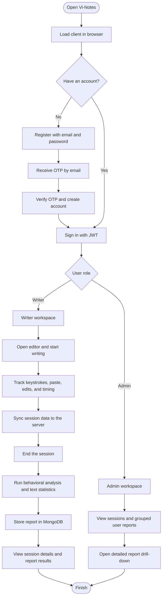

# Vi-Notes

Vi-Notes is an AI authorship verification platform that records writing behavior, analyzes session data, and stores report history in MongoDB. It includes OTP-based registration, JWT login, role-based writer and admin workspaces, and installable PWA support.

## What This App Does

- Lets a user register with email and verify the account with an OTP.
- Lets a verified user sign in and enter either the writer workspace or the admin workspace.
- Tracks typing behavior, paste events, edit patterns, and session timing inside the editor.
- Syncs session data to the server while the user writes.
- Runs server-side analysis after the session ends.
- Stores the analysis result as a report with behavioral scoring, text statistics, correlation analysis, suspicious segment detection, and confidence scoring.
- Lets admins view sessions and grouped user reports, with admin-only records filtered out of user-facing lists.
- Ships as a PWA that can be installed on supported devices.

## Tech Stack

### Frontend

| Technology      | Purpose                                 |
| --------------- | --------------------------------------- |
| React 18        | UI framework                            |
| TypeScript 5    | Type safety                             |
| Vite 4          | Dev server and bundler                  |
| vite-plugin-pwa | PWA generation and service worker build |
| Tailwind CSS 3  | Styling                                 |
| shadcn/ui       | UI primitives                           |
| Lucide React    | Icons                                   |

### Backend

| Technology           | Purpose               |
| -------------------- | --------------------- |
| Node.js              | Runtime               |
| Express 4            | HTTP server           |
| TypeScript 5         | Type safety           |
| MongoDB + Mongoose 7 | Persistence layer     |
| Zod                  | Request validation    |
| JWT                  | Authentication tokens |
| PBKDF2               | Password hashing      |

## Workflow



The server connects to MongoDB before it begins accepting requests.

## Project Structure

```
vi-notes/
├── client/   # React frontend
├── server/   # Express backend
├── types/    # Shared TypeScript contracts
├── package.json
└── README.md
```

## Local Setup

### Prerequisites

- Node.js 18 or newer
- npm with workspace support
- MongoDB, either local or MongoDB Atlas

### Install

```bash
git clone <repo-url>
cd vi-notes
npm install
```

Create your environment file:

```powershell
Copy-Item .env.example .env
```

Then fill in `.env` with your MongoDB, JWT, SMTP, and frontend URLs.

### Run in Development

```bash
npm run dev
```

This starts the server and client together. The backend listens on port 3001 and the client runs on port 5173.

Development URLs:

- Frontend: `http://localhost:5173`
- Backend API: `http://localhost:3001/api`
- Backend root: `http://localhost:3001` redirects to the frontend during development

### Build and Run Production Locally

```bash
npm run build
npm start
```

## Environment Variables

### Root / Server

| Variable                 | Default                              | Description                      |
| ------------------------ | ------------------------------------ | -------------------------------- |
| `PORT`                   | `3001`                               | Server port in local development |
| `NODE_ENV`               | `development`                        | Runtime mode                     |
| `MONGODB_URI`            | `mongodb://127.0.0.1:27017/vi-notes` | MongoDB connection string        |
| `JWT_SECRET`             | `vi-notes-secret`                    | JWT signing secret               |
| `JWT_EXPIRATION_SECONDS` | `14400`                              | JWT lifetime in seconds          |
| `SMTP_HOST`              | -                                    | SMTP host used for OTP emails    |
| `SMTP_PORT`              | `587`                                | SMTP port                        |
| `SMTP_USER`              | -                                    | SMTP username                    |
| `SMTP_PASSWORD`          | -                                    | SMTP password                    |
| `SMTP_FROM`              | -                                    | Sender email address             |
| `SMTP_SECURE`            | `false`                              | Use TLS for SMTP                 |

### Client

| Variable              | Default                     | Description             |
| --------------------- | --------------------------- | ----------------------- |
| `VITE_API_URL`        | `http://localhost:3001/api` | Client API base URL     |
| `VITE_DEV_SERVER_URL` | `http://localhost:5173`     | Frontend dev server URL |

Do not commit real credentials. Keep `.env` local and use `.env.example` as the template.

## Available Scripts

### Root

| Script               | Description                          |
| -------------------- | ------------------------------------ |
| `npm run dev`        | Start the server and client together |
| `npm run dev:server` | Start only the server workspace      |
| `npm run dev:client` | Start only the client workspace      |
| `npm run build`      | Build server and client              |
| `npm start`          | Start the production server          |
| `npm test`           | Run workspace tests                  |

### Client

| Script            | Description                     |
| ----------------- | ------------------------------- |
| `npm run dev`     | Start the Vite dev server       |
| `npm run build`   | Build the client and PWA assets |
| `npm run preview` | Preview the client build        |

### Server

| Script          | Description                                  |
| --------------- | -------------------------------------------- |
| `npm run dev`   | Start the TypeScript server with auto-reload |
| `npm run build` | Compile the server                           |
| `npm start`     | Run the compiled server                      |
| `npm test`      | Run server tests                             |

## API Reference

### Authentication

| Method | Endpoint                    | Description                            |
| ------ | --------------------------- | -------------------------------------- |
| POST   | `/api/auth/register`        | Start account creation and send an OTP |
| POST   | `/api/auth/register/resend` | Resend a pending OTP                   |
| POST   | `/api/auth/register/verify` | Verify the OTP and create the account  |
| POST   | `/api/auth/login`           | Sign in and receive a JWT token        |

### Sessions

| Method | Endpoint                           | Description                                  |
| ------ | ---------------------------------- | -------------------------------------------- |
| POST   | `/api/sessions/start`              | Start a writing session                      |
| POST   | `/api/sessions/update`             | Sync session events                          |
| POST   | `/api/sessions/end`                | End the session and trigger analysis         |
| GET    | `/api/sessions`                    | List sessions                                |
| GET    | `/api/sessions/:id`                | Get a single session                         |
| DELETE | `/api/sessions/:id`                | Delete a session                             |
| GET    | `/api/sessions/:id/export/:format` | Export a report as `json`, `html`, or `text` |
| GET    | `/api/sessions/:id/share-token`    | Generate a shareable token                   |

### Analysis

| Method | Endpoint                   | Description                |
| ------ | -------------------------- | -------------------------- |
| POST   | `/api/analysis/:sessionId` | Run analysis for a session |

### Reports

| Method | Endpoint       | Description           |
| ------ | -------------- | --------------------- |
| GET    | `/api/reports` | List archived reports |

## PWA Notes

- The client includes a manifest and service worker through `vite-plugin-pwa`.
- Installable icons are already present in `client/public/`.
- The app should be served over HTTPS in production for full PWA support.
- PWA install prompts and offline indicators are wired into the UI.

## Deployment Notes

- Use `VITE_API_URL` in the client deployment to point at the live backend API.
- Set backend environment variables in the backend deployment, not in the client deployment.
- Vercel does not need a manual `PORT` value in production.

## Security

- JWT-based authentication
- OTP-gated registration for first-time users
- SMTP-delivered verification codes with resend support
- Role-based access control for admin and writer users
- PBKDF2 password hashing
- MongoDB connection checks on startup
- Input validation through Zod on API routes
