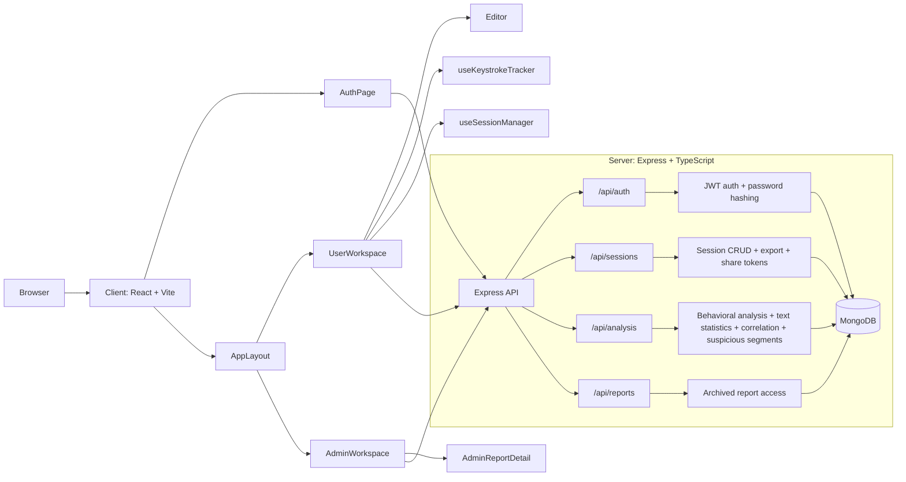

# Vi-Notes

> AI authorship verification platform that detects whether writing is human-authored, AI-assisted, or AI-generated through behavior tracking, text analysis, and MongoDB-backed reports.

## Overview

Vi-Notes tracks how people write, not just what they write. It captures keystroke timing, paste events, edit patterns, and text statistics, then combines them into a report that classifies a session as `HUMAN`, `AI_ASSISTED`, or `AI_GENERATED`.

Current capabilities:

- Writer login and registration with JWT auth
- First-time registration now uses an OTP verification step before the account is created
- Verification codes are delivered by email and can be resent during signup
- Tracked writing editor with keystrokes, pastes, edits, and active typing duration
- Session sync every 900ms while typing
- Server-side analysis with behavioral scoring, text statistics, correlation checks, and suspicious segment detection
- Report export in `json`, `html`, and `text` formats
- Shareable report tokens
- Admin views for all sessions, grouped user reports, and detailed report drill-downs

## Features

### Writer Experience

- Login and registration with role-based access
- Registration flow with one-time verification code before the account becomes active
- Resend verification code during signup if the first email is delayed or lost
- Editor with real-time tracking of typing, paste, and edit events
- Session creation, sync, end, and manual refresh flows
- Session list and detailed session view

### Analysis Pipeline

- Behavioral scoring based on typing variance, paste ratio, edit ratio, and pause patterns
- Text statistics including word count, sentence variation, lexical diversity, and lexical richness
- Correlation checks that compare writing behavior with text complexity
- Suspicious segment detection for templated phrases, tone shifts, and overly polished text
- Verdict generation with confidence and suspicion scores

### Reporting and Admin

- Detailed analysis reports stored in MongoDB
- Export support for JSON, HTML, and text formats
- Shareable report tokens
- Admin dashboard with all sessions and grouped user reports
- Full report drill-down with metrics, reasons, and suspicious segments

## Tech Stack

### Frontend

| Technology     | Purpose                         |
| -------------- | ------------------------------- |
| React 18       | UI framework                    |
| TypeScript 5   | Type safety                     |
| Vite 4         | Dev server and build tool       |
| Tailwind CSS 3 | Utility-first styling           |
| shadcn/ui      | Accessible component primitives |
| Lucide React   | Icon library                    |

### Backend

| Technology   | Purpose            |
| ------------ | ------------------ |
| Node.js      | Runtime            |
| Express 4    | HTTP server        |
| TypeScript 5 | Type safety        |
| MongoDB      | Database           |
| Mongoose 7   | ODM                |
| Zod          | Request validation |
| Custom JWT   | Auth tokens        |
| PBKDF2       | Password hashing   |

## Architecture



The server connects to MongoDB during startup before listening for requests.

## Project Structure

```
vi-notes/
├── package.json        # Root workspace scripts
├── client/             # React frontend
├── server/             # Express backend
├── types/              # Shared TypeScript contracts
└── README.md
```

## Getting Started

### Prerequisites

- Node.js 18+
- MongoDB, either local or MongoDB Atlas
- npm with workspace support

### Install

```bash
git clone <repo-url>
cd vi-notes
npm install
cp .env.example .env
```

On Windows PowerShell you can run:

```powershell
Copy-Item .env.example .env
```

Update `.env` with your MongoDB URI and secrets before starting the app.

### Run

```bash
npm run dev
```

This starts both the server and the client, opens the browser, and requires the server to connect to MongoDB successfully before the app is ready.

Development URLs:

- Frontend: `http://localhost:5173`
- Backend API: `http://localhost:3001/api`
- Backend root `http://localhost:3001` redirects to the frontend in development.

### Optional Scripts

```bash
npm run dev:server
npm run dev:client
npm run build
npm start
```

## Environment Variables

| Variable                 | Default                              | Description               |
| ------------------------ | ------------------------------------ | ------------------------- |
| `PORT`                   | `3001`                               | Server listen port        |
| `MONGODB_URI`            | `mongodb://127.0.0.1:27017/vi-notes` | MongoDB connection string |
| `NODE_ENV`               | `development`                        | Environment mode          |
| `JWT_SECRET`             | `vi-notes-secret`                    | JWT signing secret        |
| `JWT_EXPIRATION_SECONDS` | `14400`                              | Token TTL in seconds      |
| `SMTP_HOST`              | -                                    | SMTP server host          |
| `SMTP_PORT`              | `587`                                | SMTP server port          |
| `SMTP_USER`              | -                                    | SMTP username             |
| `SMTP_PASSWORD`          | -                                    | SMTP password             |
| `SMTP_FROM`              | -                                    | Sender email address      |
| `SMTP_SECURE`            | `false`                              | Use TLS for SMTP          |
| `VITE_API_URL`           | `http://localhost:3001/api`          | Client API base URL       |
| `VITE_DEV_SERVER_URL`    | `http://localhost:5173`              | Frontend dev server URL   |

Never commit real credentials to source control. Keep `.env` local and commit only `.env.example`.

## Available Scripts

### Root

| Script               | Description                                                                   |
| -------------------- | ----------------------------------------------------------------------------- |
| `npm run dev`        | Start server and client together, open the browser, stop both if either fails |
| `npm run dev:server` | Start only the server                                                         |
| `npm run dev:client` | Start only the client                                                         |
| `npm run build`      | Build server and client for production                                        |
| `npm start`          | Start the production server                                                   |
| `npm test`           | Run workspace tests                                                           |

### Client

| Script            | Description               |
| ----------------- | ------------------------- |
| `npm run dev`     | Start the Vite dev server |
| `npm run build`   | Build the client          |
| `npm run preview` | Preview the client build  |

### Server

| Script          | Description                                  |
| --------------- | -------------------------------------------- |
| `npm run dev`   | Start the TypeScript server with auto-reload |
| `npm run build` | Compile the server                           |
| `npm start`     | Run the compiled server                      |
| `npm test`      | Run server tests                             |

## API Reference

### Authentication

| Method | Endpoint                    | Description                                   |
| ------ | --------------------------- | --------------------------------------------- |
| POST   | `/api/auth/register`        | Start account creation and email an OTP       |
| POST   | `/api/auth/register/resend` | Resend a fresh OTP for a pending registration |
| POST   | `/api/auth/register/verify` | Verify the OTP and finish account creation    |
| POST   | `/api/auth/login`           | Sign in and receive a JWT token               |

### Sessions

| Method | Endpoint                           | Description                                  |
| ------ | ---------------------------------- | -------------------------------------------- |
| POST   | `/api/sessions/start`              | Start a writing session                      |
| POST   | `/api/sessions/update`             | Sync delta events to the session             |
| POST   | `/api/sessions/end`                | End the session and trigger analysis         |
| GET    | `/api/sessions`                    | List sessions                                |
| GET    | `/api/sessions/:id`                | Get a single session                         |
| DELETE | `/api/sessions/:id`                | Delete a session                             |
| GET    | `/api/sessions/:id/export/:format` | Export a report as `json`, `html`, or `text` |
| GET    | `/api/sessions/:id/share-token`    | Generate a shareable token                   |

### Analysis

| Method | Endpoint                   | Description                |
| ------ | -------------------------- | -------------------------- |
| POST   | `/api/analysis/:sessionId` | Run analysis for a session |

### Reports

| Method | Endpoint       | Description           |
| ------ | -------------- | --------------------- |
| GET    | `/api/reports` | List archived reports |

## Security

- JWT-based authentication
- OTP-gated registration for first-time users
- SMTP-delivered verification codes with resend support
- Role-based access control for admin and writer users
- PBKDF2 password hashing
- MongoDB connection checks on startup
- Input validation through Zod on API routes
