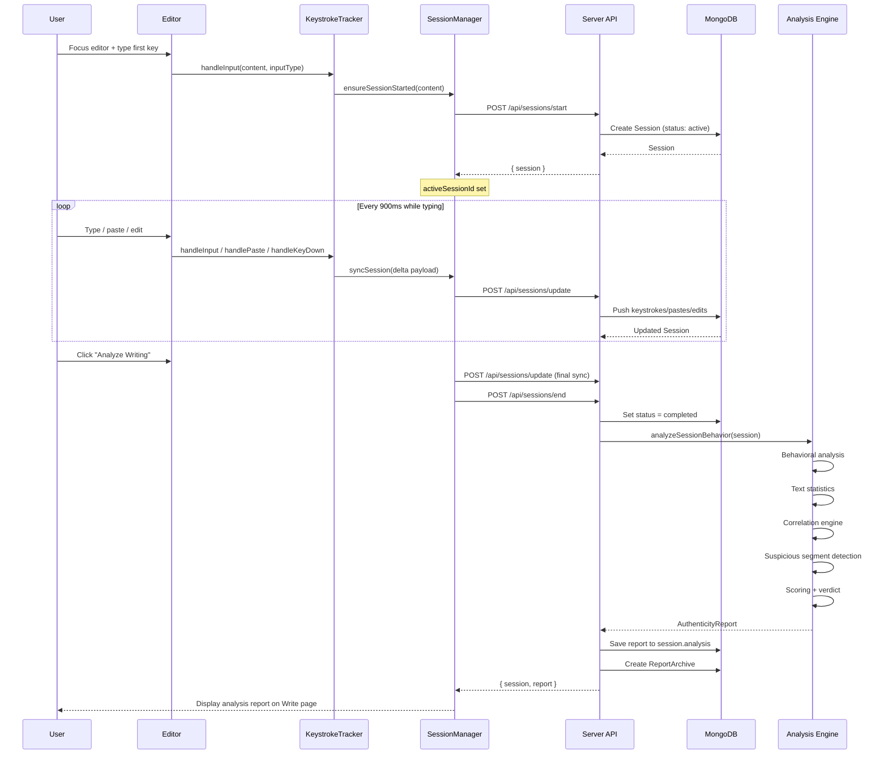
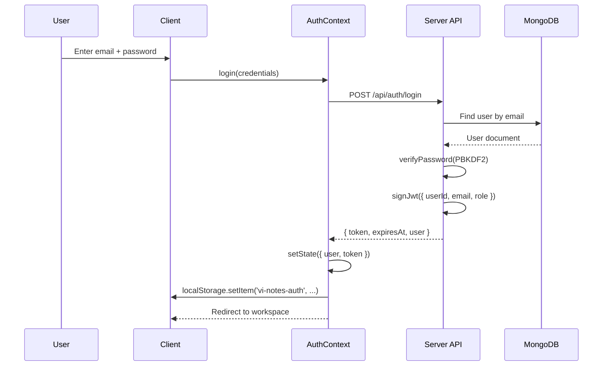
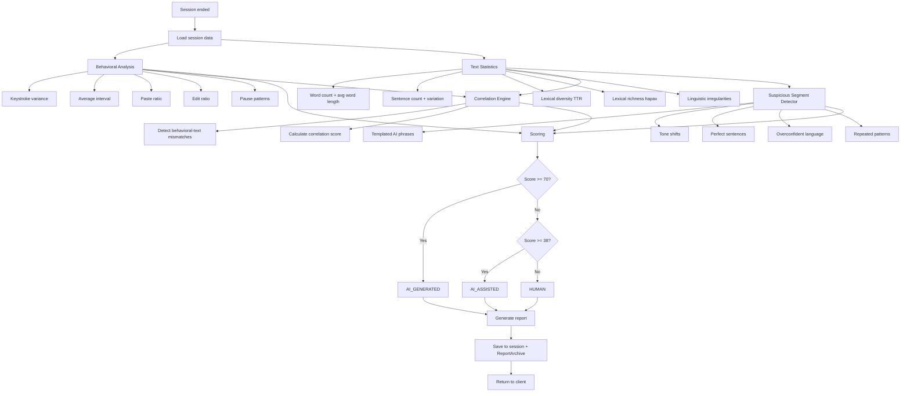
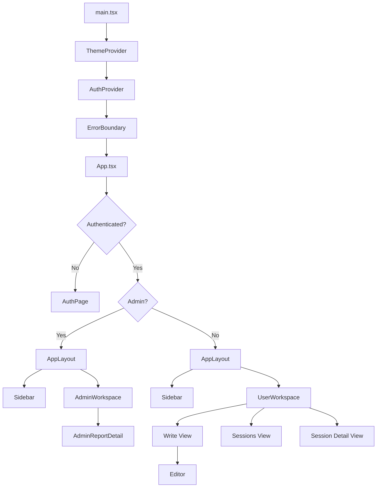
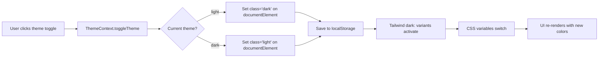
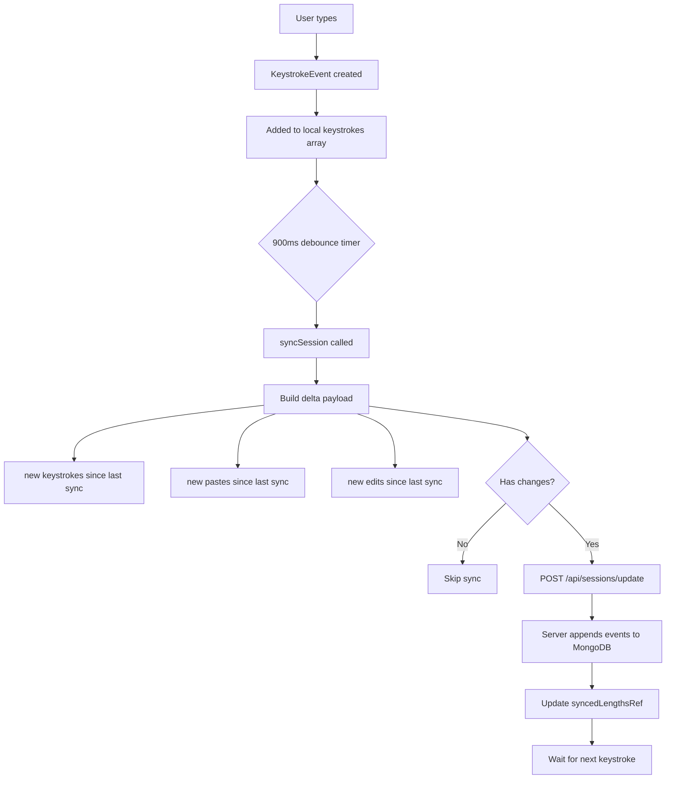

# Vi-Notes Workflow Diagrams

## Session Lifecycle



## Authentication Flow



## Admin User Reports View

```mermaid
flowchart TD
    A[Admin clicks "User Reports"] --> B[Fetch all sessions]
    B --> C[Group sessions by ownerEmail]
    C --> D{For each user group}
    D --> E[Render collapsible accordion]
    E --> F[Header: email + session count + human count + flagged count]
    E --> G[Expanded: session cards with verdict, WPM, duration, date]
    G --> H[Admin clicks a session]
    H --> I[Show AdminReportDetail]
    I --> J[Full analysis: metrics, scores, stats, verdict, reasons, segments]
```

## Analysis Pipeline



## Client Component Tree



## Theme Toggle Flow



## Delta Sync Mechanism


